# build-elevate

This template is for creating a monorepo with

- [Turborepo](https://turborepo.com/) for monorepo management
- [Next.js](https://nextjs.org/) (with Turbopack) for the web application
- [Express](https://expressjs.com/) for the API server
- [TypeScript](https://www.typescriptlang.org/) for type safety
- [Docker](https://www.docker.com/) for containerization
- [Prisma](https://www.prisma.io/) as the ORM for database access
- [PostgreSQL](https://www.postgresql.org/) as the database
- [shadcn/ui](https://ui.shadcn.com/) for UI components
- [Tailwind CSS](https://tailwindcss.com/) for styling
- [Better Auth](https://www.better-auth.com/) for authentication
- [React Email](https://react.email/) for email templates
- [Resend](https://resend.com/) for sending emails
- [Tanstack Query](https://tanstack.com/query/latest) for data fetching and state management
- [ESLint](https://eslint.org/) for linting
- [Prettier](https://prettier.io/) for code formatting
- [Jest](https://jestjs.io/) for testing
- [GitHub Actions](https://github.com/features/actions) for CI/CD
- [pnpm](https://pnpm.io/) as the package manager

---

## 🖼 Screenshots

| Page                | Light Theme                                              | Dark Theme                                                   |
| ------------------- | -------------------------------------------------------- | ------------------------------------------------------------ |
| Home                | 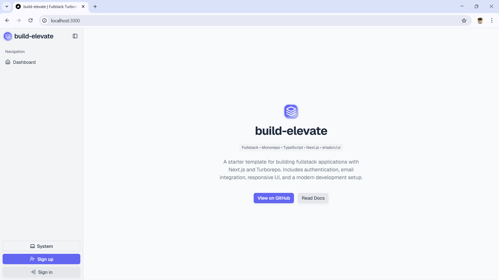                           | 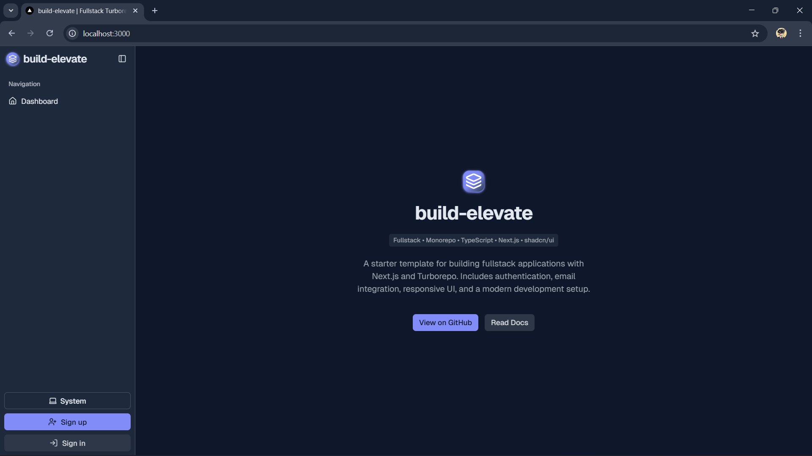                           |
| Sign Up             | 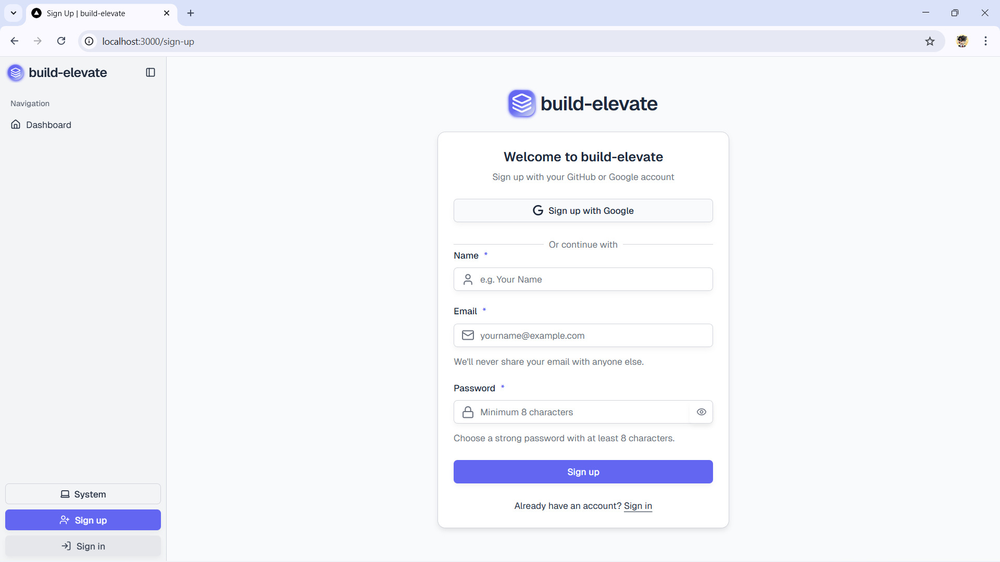                     | 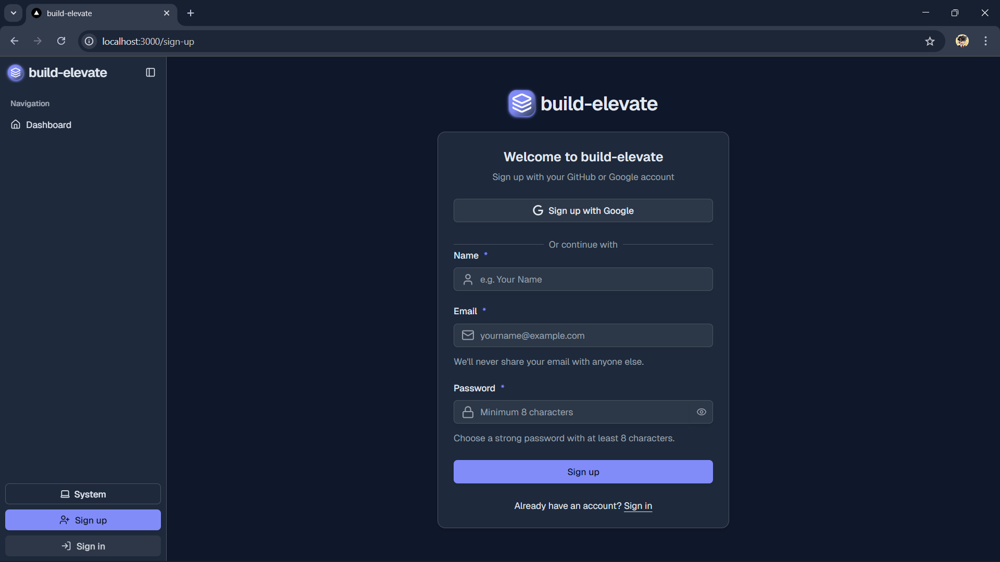                     |
| Sign In             | 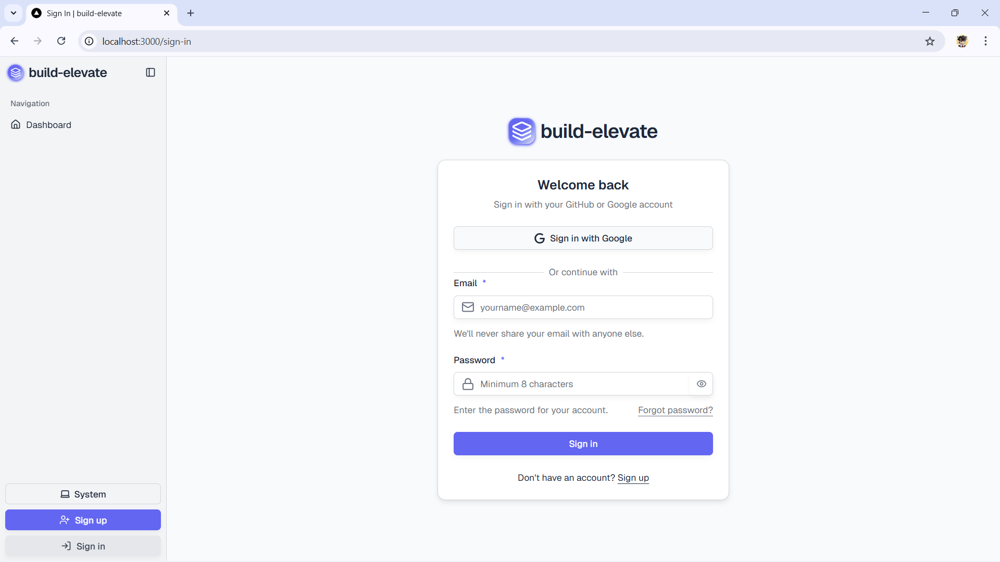                     | 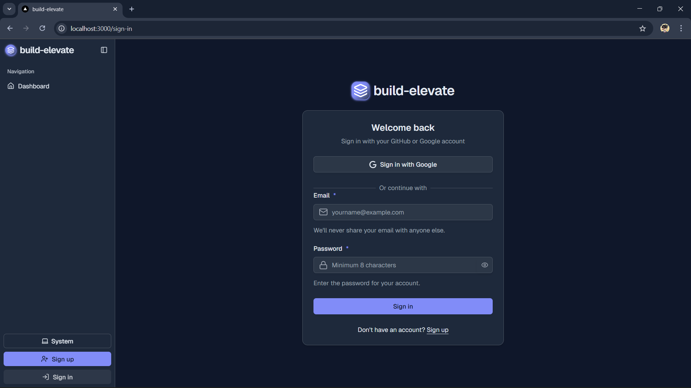                     |
| Profile             |                      | 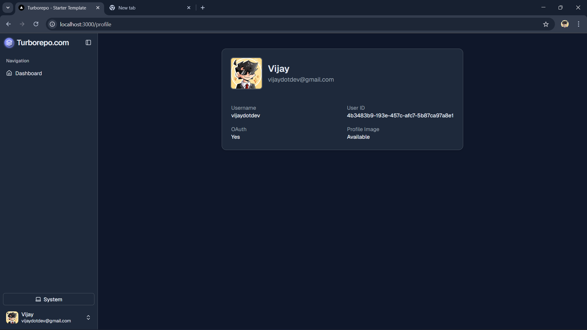                     |
| Settings - General  | 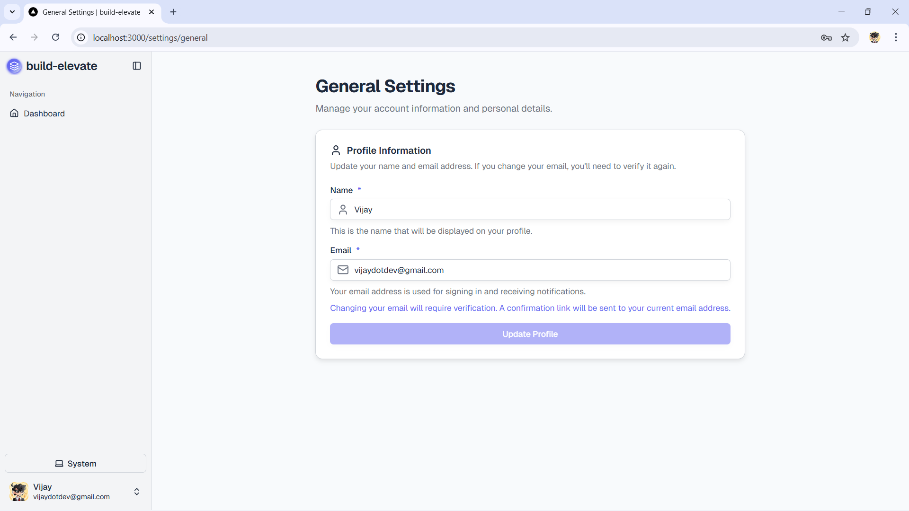   | 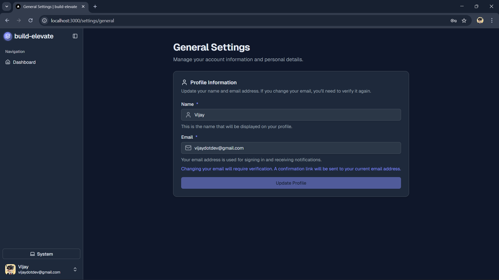   |
| Settings - Security | 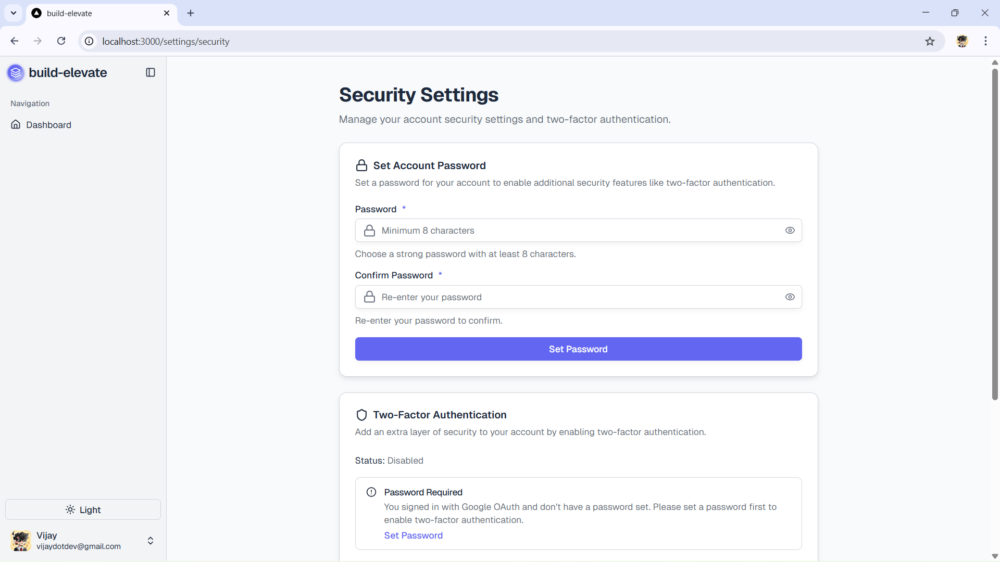 | 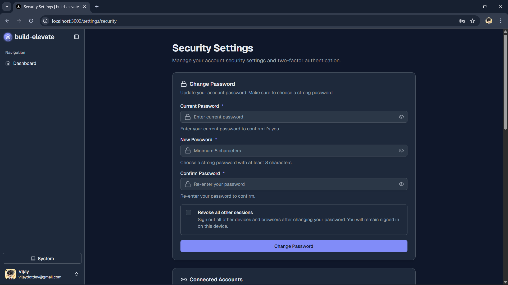 |

---

## Project Structure

This monorepo is structured into the following applications and packages:

### Applications

- `apps/web`: Next.js web application.
- `apps/api`: Express API server.

### Packages

- `packages/eslint-config`: Centralized ESLint config.
- `packages/jest-presets`: Shared Jest configuration for Node.js and React.
- `packages/prettier-config`: Shared Prettier formatting rules.
- `packages/typescript-config`: Base TypeScript configuration.
- `packages/auth`: Authentication package using Better Auth.
- `packages/db`: Shared Prisma-based database access layer.
- `packages/email`: Email features with React Email & Resend.
- `packages/ui`: Reusable UI components built with `shadcn/ui`.
- `packages/utils`: Common utilities and shared TypeScript types.

---

## Getting Started

### Setting up `apps/web`

To set up and run the web application (`apps/web`), follow the instructions in [apps/web/README.md](apps/web/README.md).

### Setting up `apps/api`

To set up and run the API server (`apps/api`), follow the instructions in [apps/api/README.md](apps/api/README.md).

---

## Docker Setup

This project includes mutiple Dockerfile and a production `docker-compose` setup for the apps.

### 1. Production

To build and run the production container:

```bash
pnpm docker:prod
```

This will:

- Build the Docker image using `docker-compose.prod.yml`
- Start the web container on `localhost:3000`
- Start the API container on `localhost:4000`
- Start the PostgreSQL database container on `localhost:5432`

Make sure you have `.env.production` in `apps/web`, `apps/api`, `packages/db`.

#### Notes

- The Dockerfile uses a **multi-stage build** for minimal image size.
- The containers runs as a **non-root user** (`nextjs`, `expressjs`) for security.
- The Docker build context includes the whole monorepo, and Turbo prunes the workspace to include only the necessary dependencies, ensuring PNPM and workspaces are resolved correctly.

---

## Root-Level Scripts

The following scripts are available at the root of the monorepo:

| Script             | Description                                                       |
| ------------------ | ----------------------------------------------------------------- |
| `pnpm build`       | Runs `turbo build` to build all apps and packages.                |
| `pnpm clean`       | Clears the Turborepo cache and outputs.                           |
| `pnpm dev`         | Runs `turbo dev` to start development servers concurrently.       |
| `pnpm docker:prod` | Builds production Docker images and runs containers for all apps. |
| `pnpm lint`        | Lints all workspaces using the shared ESLint configuration.       |
| `pnpm format`      | Formats code using Prettier across the monorepo.                  |
| `pnpm check-types` | Checks TypeScript types across all workspaces.                    |
| `pnpm start`       | Starts the production servers for all apps.                       |
| `pnpm test`        | Runs tests across all workspaces using Jest.                      |

---

## UI Components (shadcn/ui)

### Usage

```bash
pnpm dlx shadcn@latest init
```

### Adding components

To add components to your app, run the following command at the root directory:

```bash
pnpm dlx shadcn@latest add button -c apps/web
```

This will place the ui components in the `packages/ui/src/components` directory.

### Tailwind

Your `tailwind.config.ts` and `globals.css` are already set up to use the components from the `ui` package.

### Using components

To use the components in your app, import them from the `ui` package.

```tsx
import { Button } from "@workspace/ui/components/button";
```
